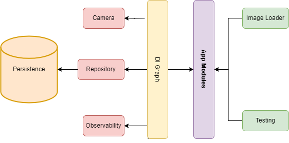
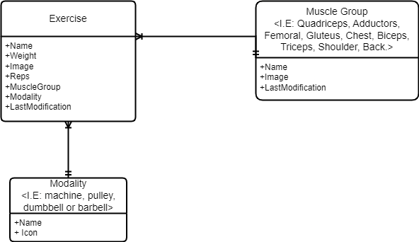

# My Gym Evolution

An application (from here on: "App") to record how much weight the user can lift in each exercise of their gym routine, so that they can see the growth they have been obtained through time.

<!-- TOC -->
* [My Gym Evolution](#my-gym-evolution)
  * [Functional Requirements](#functional-requirements)
  * [No-functional Requirements](#no-functional-requirements)
  * [Top-Level design](#top-level-design)
  * [Entities](#entities)
<!-- TOC -->

## Functional Requirements

1. The App must allow to record whatever gym exercise with its respective weight made.
2. The App must group the exercise in its respective muscle group: Quadriceps, Adductors, Femoral, Gluteus, Chest, Biceps, Triceps, Shoulder, Back.
3. The App must allow to delete exercises.
4. The App must allow to modifier the name, image, muscle group and modality of exercises.
5. The App must allow to add an image or take a picture to illustrate the exercises.
6. The App must show the muscle group sorted by the last modified date of any exercises.
7. The App must show the weight of each exercises in pounds (lb).
8. The App must allow to select the exercise modality: machine, pulley, dumbbell or barbell.
9. The App must allow you to enter the number of repetitions(reps) of the exercise.
10. The App must ask what muscle group the user is going to exercise today, then only show those muscle group. Those muscle group can will be changed.
11. The App must allow watch graphically the evolution of the weight by muscle group and exercise.
12. The App must allow that muscle group has an image.
13. The App must allow to add, modifier and delete muscle group.
14. The App must allow to add, modifier and delete modality exercises.
15. The App must be downloadable in the PlayStore.

## No-functional Requirements

1. The App must persist the data locally.
2. The App must work without internet.
3. The app must have the semantic versioning format: x.y.z.
4. The app must save the warning and error logs.
5. The app must have cover code at least 80%.
6. The app must have instrumental test.

## Top-Level design

## Entities

## Architecture Principles
-  A reactive and layered architecture.
- Unidirectional Data Flow (UDF) in all layers of the app.
- A UI layer with state holders to manage the complexity of the UI.
- Coroutines and flows.
- Dependency injection best practices.